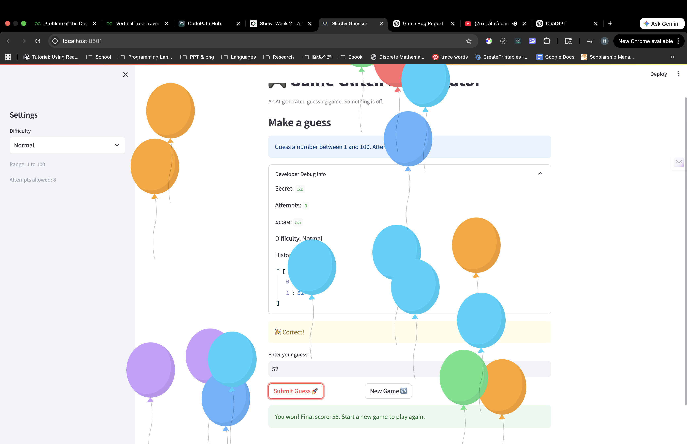

# Model Card: Game Glitch Investigator

## Model Description

This project is a rule-based AI-assisted system designed to analyze and validate the behavior of a number guessing game. It does not use a trained machine learning model but follows structured logic and testing to simulate AI reasoning and reliability.

## Intended Use

- Debugging simple game logic
- Demonstrating AI system reliability and testing
- Educational purposes for learning AI system design

## Limitations

- The system does not use real machine learning or natural language understanding
- It only works for predefined game logic scenarios
- It cannot generalize beyond the number guessing game

## Evaluation

The system was evaluated using automated reliability tests:

- 6 test cases
- 100% pass rate
- Consistent outputs across runs

## Ethical Considerations

- No personal data is used
- No bias is present since the system uses deterministic logic
- The system is transparent and explainable

## Future Improvements

- Add AI-based explanations using LLMs
- Expand to more complex debugging scenarios
- Improve error handling and edge case detection

## Demo

## Reflection and Ethics

### Limitations and Biases

This system is based on simple rule-based logic rather than a trained AI model, which limits its ability to handle complex or unexpected inputs. It only works within the scope of a number guessing game and cannot generalize to other applications. While it does not exhibit traditional data bias, it is limited by its predefined logic and lack of adaptability.

### Potential Misuse and Prevention

The system itself has low risk of misuse because it does not process sensitive data or make high-stakes decisions. However, if extended to more complex systems, incorrect logic or lack of testing could lead to misleading outputs. To prevent misuse, I implemented reliability testing and logging to ensure consistent and transparent behavior.

### Reliability Insights

While testing the system, I was surprised by how small logic errors could completely break the reliability of the program. Initially, all tests failed due to an incomplete function, which showed the importance of proper implementation before evaluation. After fixing the logic, the system achieved a perfect reliability score, demonstrating how structured testing can quickly identify and resolve issues.

### Collaboration with AI

During this project, I used AI as a coding assistant to help structure the system and improve reliability.

One helpful suggestion from AI was to create a separate reliability testing script (`reliability_tests.py`). This made it much easier to validate the system and ensured that the logic worked consistently across multiple test cases.

However, one flawed suggestion was assuming that the existing `check_guess` function was already implemented correctly. In reality, it was incomplete and caused all tests to fail. This highlighted the importance of verifying AI-generated suggestions rather than blindly trusting them.

Overall, this project taught me that AI is a powerful tool for accelerating development, but human oversight is essential to ensure correctness and reliability.
